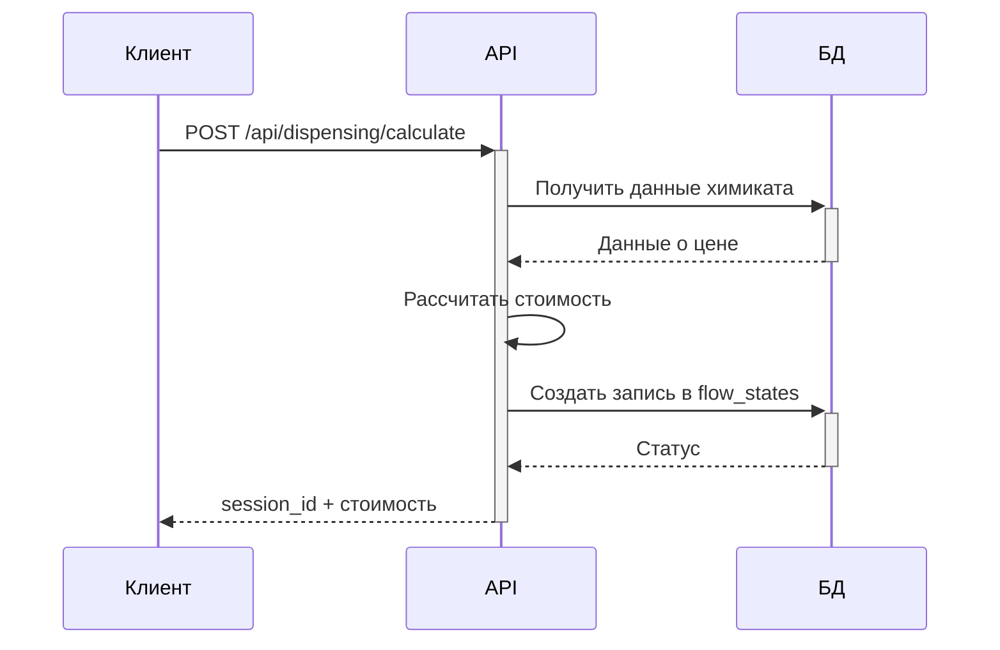
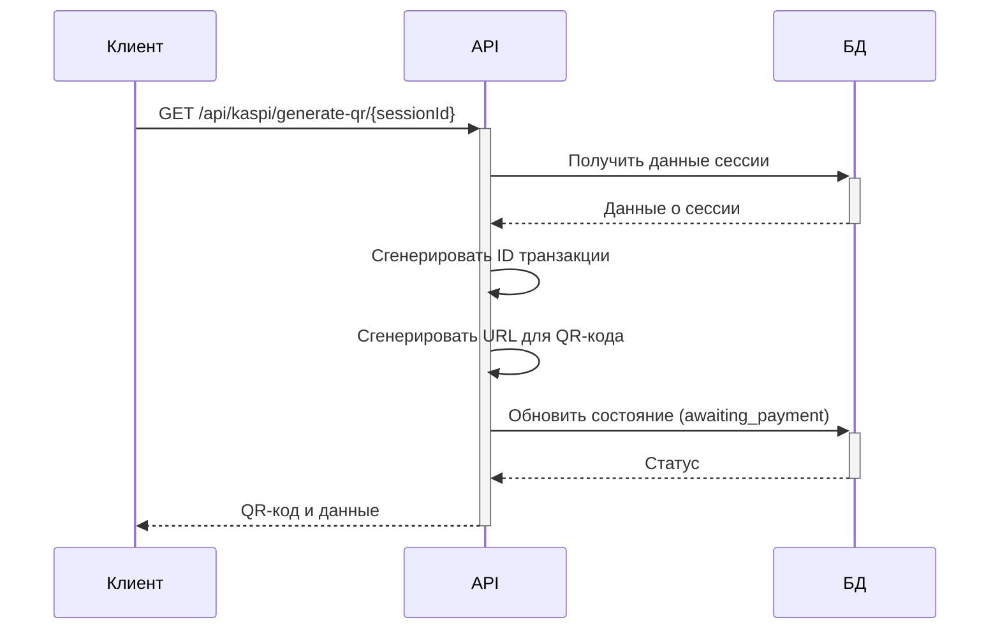
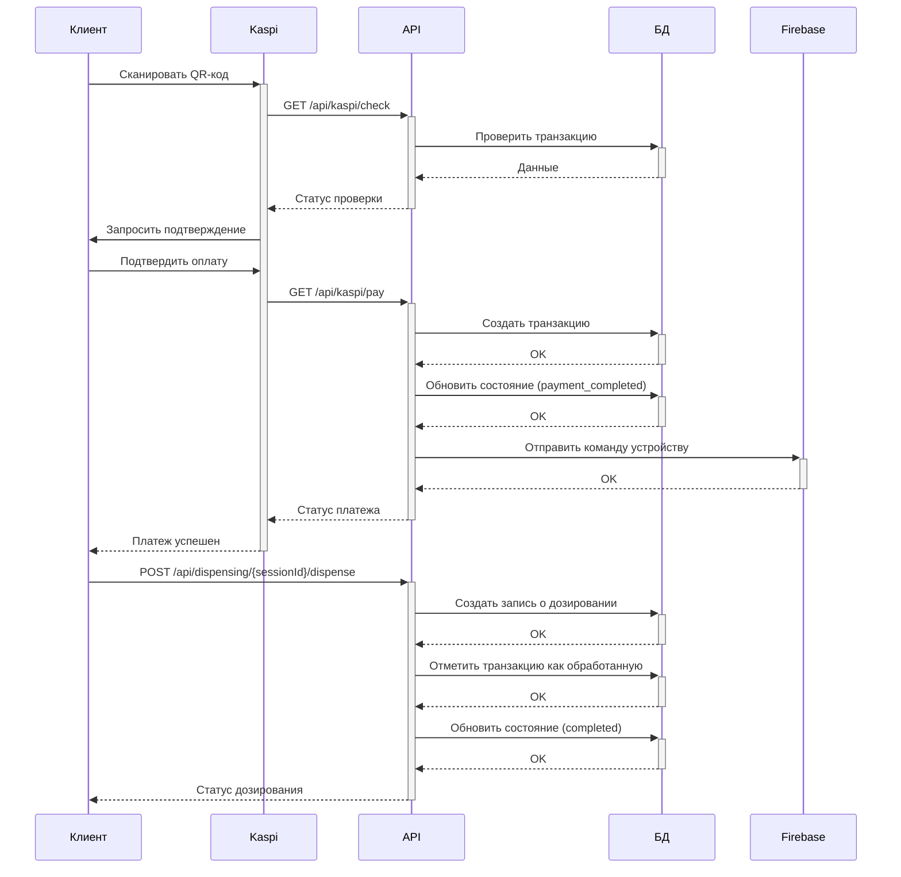

# Руководство разработчика: Модель прямой оплаты EcoTrend

Это руководство описывает архитектуру, API и процесс работы с системой прямой оплаты операций дозирования в EcoTrend.

## Основные принципы

1. **Прямая оплата операций**
   - Каждая операция дозирования оплачивается отдельно через Kaspi
   - Не используется предоплаченный баланс устройства
   - Стоимость рассчитывается на основе выбранного химиката и объема

2. **Отслеживание состояния процесса**
   - Каждый процесс дозирования имеет уникальный ID сессии
   - Система отслеживает этапы от выбора химиката до завершения дозирования
   - Все данные хранятся в таблице `flow_states`

3. **Интеграция с Kaspi**
   - Используется API Kaspi для проверки и обработки платежей
   - Для каждой операции генерируется QR-код с точной суммой

## Процесс дозирования

### 1. Расчет стоимости


### 2. Генерация QR-кода


### 3. Оплата и дозирование


## Модели данных

### FlowState
Отслеживает состояние процесса дозирования

| Поле | Тип | Описание |
|------|-----|----------|
| id | INT | Первичный ключ |
| session_id | VARCHAR(36) | Уникальный ID сессии (UUID) |
| device_id | VARCHAR(100) | ID устройства |
| stage | ENUM | Этап процесса (calculated, awaiting_payment, payment_completed, dispensing, completed) |
| chemical_id | INT | ID выбранного химиката |
| tank_number | INT | Номер выбранного бака |
| volume | DECIMAL | Выбранный объем в мл |
| amount | DECIMAL | Рассчитанная сумма |
| transaction_id | VARCHAR | ID транзакции Kaspi |
| created_at | TIMESTAMP | Дата создания |
| updated_at | TIMESTAMP | Дата обновления |

### Transaction
Хранит информацию о платежах

| Поле | Тип | Описание |
|------|-----|----------|
| id | INT | Первичный ключ |
| txn_id | VARCHAR | ID транзакции в системе Kaspi |
| prv_txn_id | VARCHAR | ID транзакции провайдера |
| device_id | VARCHAR | ID устройства |
| tank_number | INT | Номер бака химиката |
| chemical_name | VARCHAR | Название химиката |
| volume | DECIMAL | Объем в мл |
| amount | DECIMAL | Сумма платежа |
| status | INT | Статус транзакции (0 - успешно) |
| dispensed | BOOLEAN | Флаг завершения дозирования |
| created_at | TIMESTAMP | Дата создания |

### DispensingOperation
Хранит информацию о выполненных операциях дозирования

| Поле | Тип | Описание |
|------|-----|----------|
| id | INT | Первичный ключ |
| transaction_id | INT | ID транзакции |
| device_id | VARCHAR | ID устройства |
| tank_number | INT | Номер бака |
| chemical_name | VARCHAR | Название химиката |
| price_per_liter | DECIMAL | Цена за литр |
| volume | DECIMAL | Объем в мл |
| total_cost | DECIMAL | Общая стоимость |
| status | ENUM | Статус операции |
| receipt_number | VARCHAR | Номер чека |
| created_at | TIMESTAMP | Дата создания |

## API Endpoints

### Расчет стоимости
```
POST /api/dispensing/calculate
```

**Входные данные:**
```json
{
  "device_id": "DEVICE-001",
  "tank_number": 1,
  "volume": 500
}
```

**Выходные данные:**
```json
{
  "success": true,
  "data": {
    "session_id": "96ccf82a-6d05-4b9c-8be0-60f8eb5c6b0c",
    "device_id": "DEVICE-001",
    "tank_number": 1,
    "chemical_name": "Test Chemical",
    "volume": 500,
    "price_per_liter": 100,
    "total_cost": 50
  }
}
```

### Генерация QR-кода
```
GET /api/kaspi/generate-qr/{sessionId}
```

**Выходные данные:**
```json
{
  "success": true,
  "data": {
    "session_id": "96ccf82a-6d05-4b9c-8be0-60f8eb5c6b0c",
    "device_id": "DEVICE-001",
    "amount": 50,
    "txn_id": "TXN1649864320123123",
    "qr_code_url": "https://pay.kaspi.kz/payment?service=CHEMICAL_DISPENSING&account=DEVICE-001&amount=50&txn_id=TXN1649864320123123"
  }
}
```

### Проверка статуса
```
GET /api/dispensing/status/{sessionId}
```

**Выходные данные:**
```json
{
  "success": true,
  "data": {
    "session_id": "96ccf82a-6d05-4b9c-8be0-60f8eb5c6b0c",
    "status": "awaiting_payment",
    "device_id": "DEVICE-001",
    "stage": "awaiting_payment",
    "tank_number": 1,
    "volume": 500,
    "amount": 50,
    "transaction": null,
    "dispensing": null
  }
}
```

### Выполнение дозирования
```
POST /api/dispensing/{sessionId}/dispense
```

**Выходные данные:**
```json
{
  "success": true,
  "data": {
    "session_id": "96ccf82a-6d05-4b9c-8be0-60f8eb5c6b0c",
    "device_id": "DEVICE-001",
    "tank_number": 1,
    "chemical_name": "Test Chemical",
    "volume": 500,
    "amount": 50,
    "receipt_number": "R-DEVICE-001-1681384320123"
  }
}
```

### История дозирований
```
GET /api/dispensing/history/{deviceId}
```

**Выходные данные:**
```json
{
  "success": true,
  "data": {
    "device_id": "DEVICE-001",
    "operations": [
      {
        "id": 1,
        "transaction_id": 1,
        "device_id": "DEVICE-001",
        "tank_number": 1,
        "chemical_name": "Test Chemical",
        "price_per_liter": 100,
        "volume": 500,
        "total_cost": 50,
        "status": "completed",
        "receipt_number": "R-DEVICE-001-1681384320123",
        "created_at": "2025-04-13T00:12:00.000Z"
      }
    ],
    "pagination": {
      "limit": 10,
      "offset": 0
    }
  }
}
```

## Интеграция с мобильным приложением

### Основные сценарии

1. **Выбор химиката и расчет стоимости**
   - Пользователь выбирает устройство, химикат и объем
   - Приложение отправляет запрос на расчет стоимости
   - Приложение получает `session_id` и стоимость

2. **Генерация QR-кода для оплаты**
   - Приложение запрашивает QR-код для оплаты
   - Отображает QR-код и стоимость пользователю

3. **Отслеживание статуса**
   - Приложение периодически опрашивает API для проверки статуса
   - После подтверждения оплаты отправляет запрос на дозирование

### Примеры кода (React Native)

```javascript
// Расчет стоимости
const calculateCost = async (deviceId, tankNumber, volume) => {
  try {
    const response = await api.post('/dispensing/calculate', {
      device_id: deviceId,
      tank_number: tankNumber,
      volume: volume
    });
    return response.data.data;
  } catch (error) {
    console.error('Error calculating cost:', error);
    throw error;
  }
};

// Генерация QR-кода
const generateQRCode = async (sessionId) => {
  try {
    const response = await api.get(`/kaspi/generate-qr/${sessionId}`);
    return response.data.data;
  } catch (error) {
    console.error('Error generating QR code:', error);
    throw error;
  }
};

// Проверка статуса
const checkStatus = async (sessionId) => {
  try {
    const response = await api.get(`/dispensing/status/${sessionId}`);
    return response.data.data;
  } catch (error) {
    console.error('Error checking status:', error);
    throw error;
  }
};

// Выполнение дозирования
const dispense = async (sessionId) => {
  try {
    const response = await api.post(`/dispensing/${sessionId}/dispense`);
    return response.data.data;
  } catch (error) {
    console.error('Error dispensing:', error);
    throw error;
  }
};
```

## Обработка ошибок

### Коды ошибок

| Код | Описание |
|-----|----------|
| 400 | Неверные параметры запроса |
| 401 | Неавторизованный доступ |
| 403 | Доступ запрещен |
| 404 | Ресурс не найден |
| 409 | Конфликт (например, повторная попытка дозирования) |
| 500 | Внутренняя ошибка сервера |

### Структура ответа с ошибкой

```json
{
  "success": false,
  "message": "Failed to calculate cost",
  "error": "Chemical not found"
}
```

## Безопасность

1. **Валидация данных**
   - Все входные данные валидируются на стороне сервера
   - Проверяется соответствие устройства, химиката и сессии

2. **Проверка IP-адреса Kaspi**
   - Запросы от Kaspi проверяются по IP-адресу
   - Сконфигурировано в `middleware/auth.js`

3. **Предотвращение повторного дозирования**
   - Каждая транзакция имеет флаг `dispensed`
   - Система не позволяет выполнить дозирование дважды

## Рекомендации по разработке

1. **Тестирование**
   - Используйте тесты в `tests/direct-payment.test.js`
   - Создавайте моки для Firebase и Kaspi API

2. **Логирование**
   - Используйте `logger.js` для всех операций
   - Логируйте все этапы процесса для отладки

3. **Обработка ошибок**
   - Используйте блоки try-catch для обработки ошибок
   - Возвращайте информативные сообщения об ошибках

4. **Транзакции в БД**
   - Используйте транзакции для связанных операций
   - Обеспечивайте атомарность операций

## Вопросы и поддержка

При возникновении вопросов обращайтесь к руководителю разработки или по адресу nurdamiron@gmail.com.